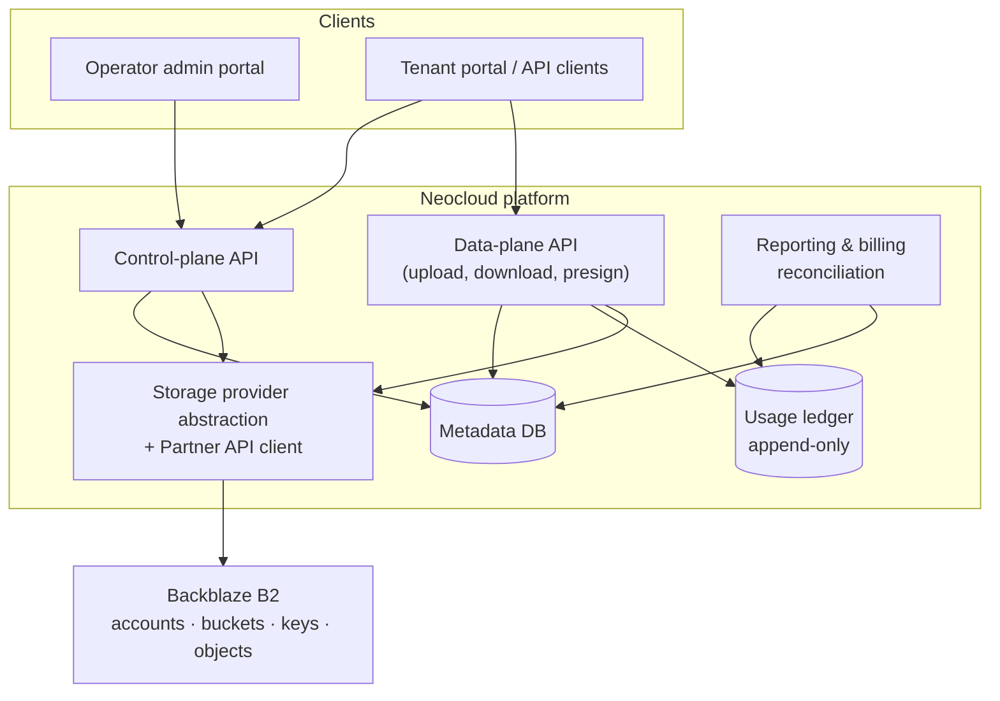

<!-- last_verified: 2026-06-26 -->
# Neocloud/Partner Vibe Kit

> A Claude-ready implementation guide for Backblaze partners building a B2-backed
> multi-tenant storage platform — control plane, high-throughput data plane,
> usage/reporting layer, provisioning workflows, and operational foundation.

<p align="center">
  <a href="https://github.com/backblaze-b2-samples/Neocloud-Powered-By-Vibe-Starter-Kit/actions/workflows/kit-qa.yml"></a>
  <a href="LICENSE"></a>
  
  <a href="CONTRIBUTING.md"></a>
</p>

**Who it's for.** Any partner offering storage to their own customers on top of Backblaze B2: neoclouds (AI/GPU clouds), MSPs and managed-service providers, SaaS platforms embedding storage, backup/archive vendors, and resellers. A "neocloud" is the headline example, but the same foundation — Partner API provisioning, account/sub-account tenant isolation, usage attribution, and billing/chargeback — applies across all of these.

This is **not** a simple upload/list/download app and it is **not** a finished production platform. It is a reference package that helps Claude and engineers build the platform correctly, incrementally, and with tests.

## Architecture at a glance



> Full diagrams — tenant isolation, provisioning, upload, billing, data model — are in
> [`docs/architecture-diagrams.md`](docs/architecture-diagrams.md).

## Getting started

You build the platform incrementally by running **one Claude prompt per PR** (12 PRs, in order). Before building anything, run the concept demo to watch the kit's core invariants work against a real bucket.

### Prerequisites

- A Backblaze B2 account and a **throwaway** bucket — the demo writes and then deletes test objects.
- A B2 application key scoped to that bucket with **read + write + delete**. Never use the operator master key here (Backblaze rejects it at the S3 layer anyway).
- **Python 3.9+** to run the concept demo.
- **Claude Code** (or the Claude app) to run the PR prompts that build the platform.

### Step 1 — See it work (install + run the concept demo)

```bash
cp .env.example .env          # then fill in your THROWAWAY bucket's B2 key
pip install -r quickstart/requirements.txt
python quickstart/quickstart.py
```

One command exercises four hard invariants — distribution_id-first naming, durable usage events, metadata-based browsing, and presigned download — against your bucket, then cleans up everything it wrote (objects under a unique prefix + a temp SQLite ledger). Expected output ends with a usage summary and `cleaned up …`. See [`quickstart/README.md`](quickstart/README.md). The demo is a *learning artifact*, not the platform.

### Step 2 — Build your first project (PR 1, the foundation)

The demo is throwaway; PR 1 is the real first deliverable. In a fresh Claude session opened in this repo:

1. Paste the contents of [`prompts/pr1-foundation.md`](prompts/pr1-foundation.md).
2. Claude follows the prompt's required reading — `START_HERE.md` → `CLAUDE.md` golden rules → `context-packs/foundation.context.md` → `docs/data-model.md` — then implements the multi-tenant data model, demo mode, and the B2 file-name builder.
3. Check the result against [`examples/expected-pr-outputs.md`](examples/expected-pr-outputs.md) ("what good looks like" for each PR), then move on to PR 2.

Implement PRs in order — each one builds the foundation the next assumes.

### A few example "first projects"

| Goal | What to run | Notes |
|---|---|---|
| Stand up the data model and auth | `prompts/pr1-foundation.md`, then `prompts/pr2-auth-rbac-api-keys.md` | The minimum to have tenants, projects, RBAC, and audit events. |
| Add resilient uploads + downloads | `prompts/pr3-parallel-resilient-uploads.md`, then `prompts/pr4-download-presigned-urls.md` | Multipart, retry, concurrency, abort; presigned URLs and range reads. Requires PRs 1–2. |
| Tailor the build to a workload | Copy `customer-overlays/customer-profile.example-ai-training.yaml` to `customer-profile.yaml`, then run a PR prompt | Overlays set concurrency, bucket layout, report format, etc. They can override configurable defaults but never the hard invariants in `docs/source-of-truth.md`. |

To save tokens, tell Claude "minimal context mode" — it then loads only `START_HERE.md`, `CLAUDE.md`, and the one prompt. See `START_HERE.md`.

## Start here

Read `START_HERE.md` first. It routes Claude to the smallest useful context for the task and prevents customers from loading the entire kit.

The kit has two layers:

| Layer | Files | Purpose |
|---|---|---|
| Low-token execution layer | `START_HERE.md`, `context-packs/`, `prompts/`, `customer-overlays/`, `docs/quality-gates.md` | Day-to-day Claude execution with minimal context. |
| Full reference layer | `docs/`, `examples/` | Source-of-truth architecture, contracts, examples, and reference artifacts. |

## What this provides vs. the original Vibe Coding Starter Kit

The original Vibe Coding Starter Kit is useful for developer experience, local setup, simple B2 API examples, and basic UI patterns. The Neocloud/Partner Vibe Kit tells Claude and engineers how to build a real multi-tenant partner storage foundation: account/sub-account tenant isolation, high-throughput uploads, provisioning, usage reporting, billing/chargeback, audit logs, and operations.

## Canonical implementation roadmap

The 12 PRs land in six stages — each one builds the foundation the next assumes.

| Stage | PRs | What it delivers |
|---|---|---|
| Schema and access | 1–2 | Multi-tenant data model, authorization, audit events |
| Data plane | 3–4 | Production upload (multipart, retry, concurrency, abort) and download (presigned URLs, range reads) |
| Money | 5–7 | Durable usage ledger, B2 CSV reconciliation, billing-period reports |
| Provisioning | 8–9 | Provider abstraction and real B2 customer account / Group provisioning |
| UI | 10–11 | Operator admin portal and tenant self-service portal |
| Operations | 12 | Metrics, alerts, runbooks, stuck multipart cleanup, reconciliation drift monitoring |

The full PR-by-PR breakdown with acceptance criteria lives in `docs/implementation-roadmap.md`. One copy/paste Claude prompt per PR is in `prompts/`.

## Core design decisions

- Neocloud tenant isolation is account/sub-account-driven, not bucket-driven.
- A tenant/customer maps to one or more provisioned B2 customer accounts/sub-accounts.
- Groups are enabled and existing Backblaze Groups are used to organize customer accounts; Groups are created in the Backblaze website, not through the Partner API.
- B2 has a default limit of 100 buckets per account, so buckets are child resources for workload/policy design, not the primary isolation model.
- Partner API must be enabled through Backblaze sales/team process. Customers cannot self-enable it.
- Partner API is required for provisioning and ejecting customer accounts.
- Recommended account alias/memberEmail pattern: `<partner_customer_id>-<b2_partner_region>@<partner_storage_domain>`. The Neocloud alias maps to Backblaze `memberEmail`.
- Partner API eject is not normal suspension: the account is removed from the Group but is not deleted, existing application keys can continue to function unless handled separately, and the account cannot be re-added to a Group through the Partner API.
- A B2 customer account lives in a pre-defined region; multi-region customers require multiple customer accounts/sub-accounts.
- B2 object keys are B2 file names. For high-scale generated names, use B2 file-name distribution across the lexicographical keyspace. The first file-name component should be the hash-derived `distribution_id`; `objects` is not a bucket or directory.
- B2 should be treated as high-throughput object storage, not a high-IOPS tiny-object database.
- Avoid unnecessary tiny-object amplification where practical. Prefer 1 MB+ objects when practical, but do not globally reject small files.

## Directory layout

```text
neocloud-vibe-kit/
├── START_HERE.md                          # routing — read first
├── CLAUDE.md                              # operating manual and golden rules
├── README.md                              # this file
├── quickstart/                            # 5-min runnable concept demo (not the platform)
├── context-packs/                         # token-efficient per-phase summaries
│   ├── README.md
│   ├── foundation.context.md
│   ├── uploads.context.md
│   ├── provisioning.context.md
│   ├── usage-reporting.context.md
│   ├── billing.context.md
│   ├── portal.context.md
│   ├── operations.context.md
│   └── small-files.context.md
├── customer-overlays/                     # per-deployment overrides
│   ├── README.md
│   ├── customer-profile.template.yaml
│   ├── customer-profile.example-ai-training.yaml
│   ├── customer-profile.example-media-archive.yaml
│   └── customer-profile.example-multi-workload.yaml
├── docs/
│   ├── source-of-truth.md                 # precedence order and hard invariants
│   ├── neocloud-architecture.md           # system layers and core entities
│   ├── neocloud-requirements.md           # requirements by domain and persona
│   ├── api-contracts.md                   # target neocloud application API
│   ├── data-model.md                      # canonical entities and columns
│   ├── provisioning-and-partner-api.md    # tenant lifecycle and Partner API
│   ├── s3-compatible-api.md               # S3 API surface, supported ops, auth
│   ├── migrating-from-aws-s3.md           # convert AWS S3 tooling/code to B2
│   ├── upload-data-plane.md               # upload flows, concurrency, retry
│   ├── usage-reporting-and-billing.md     # CSV ingestion, attribution, billing
│   ├── cost-and-tco.md                    # B2 cost model, partner margin, TCO
│   ├── security-and-tenant-isolation.md   # isolation model and key scoping
│   ├── small-file-and-throughput-guidance.md   # object size strategy
│   ├── implementation-roadmap.md          # PR-by-PR roadmap
│   ├── testing-matrix.md                  # test coverage matrix by PR
│   ├── quality-gates.md                   # required checks before merging
│   ├── workflow-recipes.md                # step-by-step recipes for common tasks
│   ├── operational-runbook.md             # incident response, severity, remediation
│   ├── first-time-operator-setup.md       # operator-side onboarding checklist
│   ├── security-review-checklist.md       # pre-production security gate
│   ├── common-pitfalls.md                 # recurring mistakes and how to avoid them
│   ├── configuration-reference.md         # all configurable settings
│   ├── glossary.md                        # canonical term definitions
│   ├── known-gaps.md                      # what is intentionally missing
│   ├── demo-script.md                     # walkthrough for technical audiences
│   ├── reuse-from-original-vibe-kit.md    # what to reuse vs rebuild
│   └── adr/                               # architecture decision records
│       ├── 000-template.md
│       ├── 001-account-subaccount-tenant-isolation.md
│       ├── 002-b2-file-name-distribution.md
│       ├── 003-provider-account-first-usage-attribution.md
│       ├── 004-multipart-upload-defaults.md
│       ├── 006-high-throughput-not-high-iops.md
│       ├── 007-partner-api-enablements-and-regional-accounts.md
│       └── 008-b2-native-vs-s3-compatible.md
├── prompts/                               # one canonical prompt per PR
│   ├── README.md
│   ├── pr1-foundation.md
│   ├── pr2-auth-rbac-api-keys.md
│   ├── pr3-parallel-resilient-uploads.md
│   ├── pr4-download-presigned-urls.md
│   ├── pr5-usage-event-ledger.md
│   ├── pr6-b2-csv-ingestion-reconciliation.md
│   ├── pr7-billing-reporting-foundation.md
│   ├── pr8-provider-abstraction.md
│   ├── pr9-tenant-provisioning.md
│   ├── pr10-platform-admin-portal.md
│   ├── pr11-tenant-portal.md
│   └── pr12-operational-hardening.md
└── examples/
    ├── README.md
    ├── expected-pr-outputs.md             # per-PR "what good looks like" reference
    ├── api-payloads.md                    # B2 API request/response shapes
    └── sample-usage-csv/                  # sample B2 usage CSV with docs
```

## Customer overlays

Use `customer-overlays/customer-profile.template.yaml` to customize workflow choices such as upload concurrency, report format, bucket layout inside customer accounts, region/account mapping, small-file packing strategy, and portal scope. Overlays may override configurable defaults, but they must not override hard invariants in `docs/source-of-truth.md`.

## API surfaces and Postman reference

Backblaze exposes three distinct API surfaces relevant to neocloud:

- **B2 Native API** — Backblaze's native HTTP API for authorization, buckets, application keys, uploads, downloads, and file metadata.
- **Partner API** — Programmatic provisioning of customer accounts within Backblaze Groups (`b2_create_group_member`, `b2_eject_group_member`, `b2_list_groups`, `b2_list_group_members`). Partner API operations live on the same base URL as the B2 Native API. See `docs/provisioning-and-partner-api.md` for the flow.
- **S3-compatible API** — Backblaze's S3 protocol endpoints (e.g., `s3.us-west-004.backblazeb2.com`), AWS SigV4 auth. The `storage_accounts.s3_endpoint` column records the S3 endpoint for each customer account.

For ready-to-run Postman collections covering these surfaces, use Backblaze's public Postman workspace: <https://www.postman.com/backblaze/backblaze/overview>. Treat it as **reference material**, not the target neocloud application API contract — for that, use `docs/api-contracts.md`.
