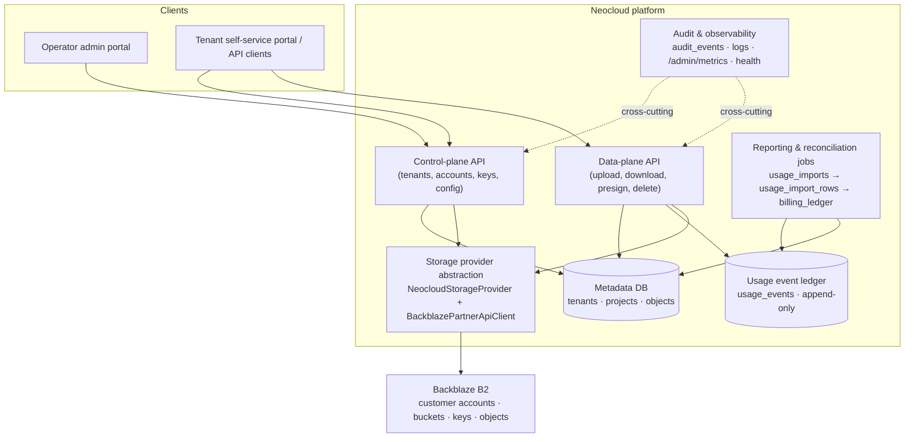
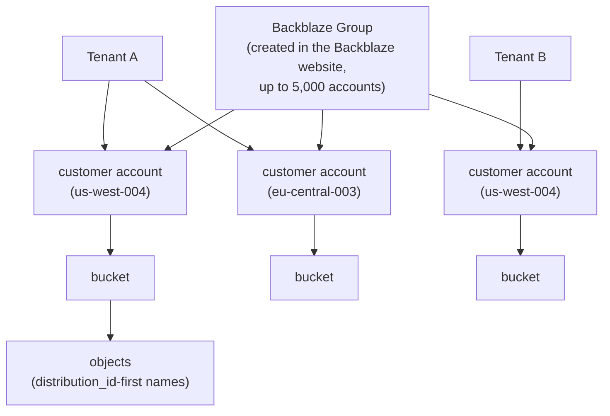
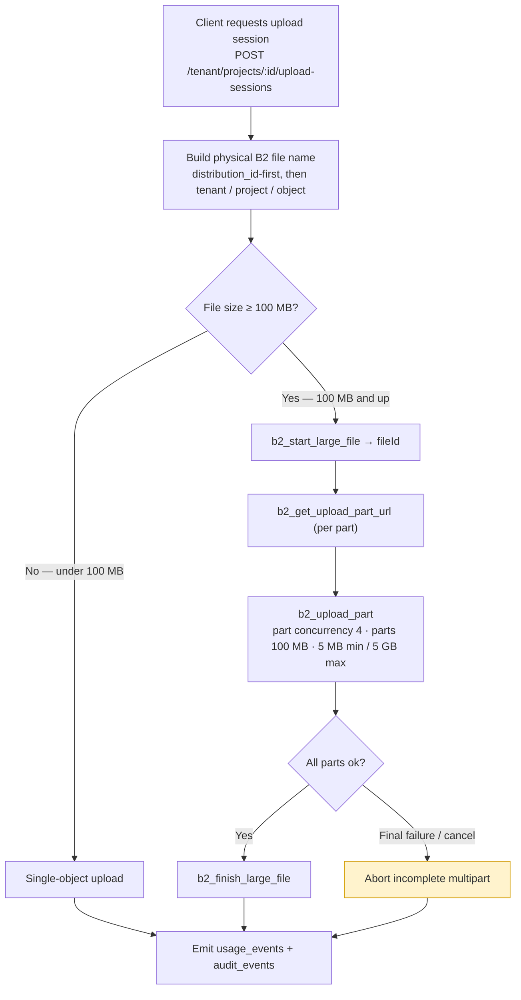
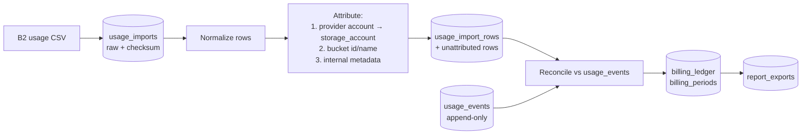
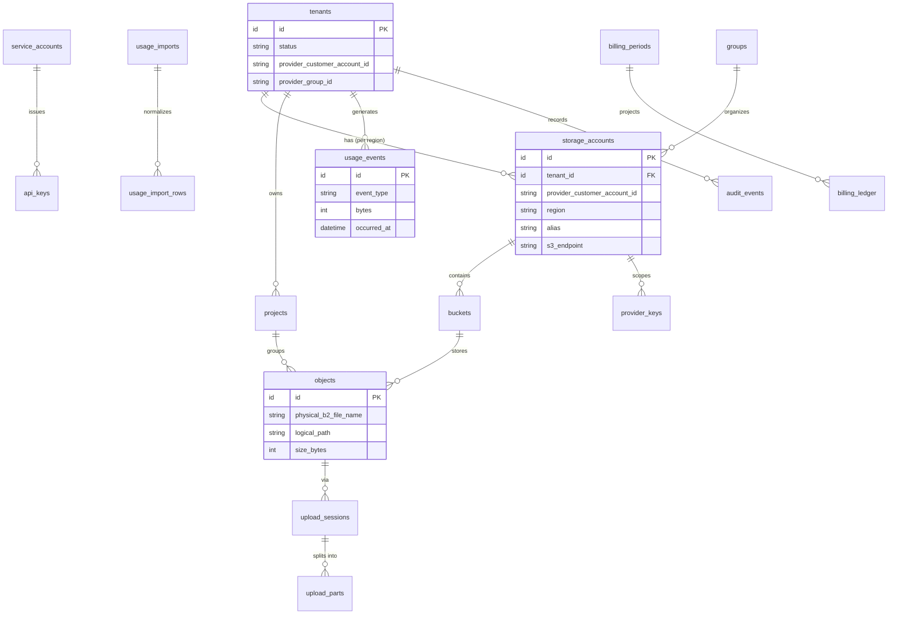

<!-- last_verified: 2026-06-26 -->
# Architecture Diagrams

Visual companion to the kit. Every diagram here reflects the golden rules in
`CLAUDE.md` and the hard invariants in `docs/source-of-truth.md` — account/sub-account
tenant isolation, website-created Groups, `distribution_id`-first B2 file names,
provider-account-first usage attribution, and durable (append-only) usage records.

These diagrams are reference, not source of truth. When a diagram and a doc disagree,
the doc wins — fix the diagram. The canonical text lives in
`docs/neocloud-architecture.md`, `docs/provisioning-and-partner-api.md`,
`docs/upload-data-plane.md`, `docs/usage-reporting-and-billing.md`, and
`docs/data-model.md`.

## System layers



## Tenant isolation (account/sub-account, not bucket)

Isolation is driven by provisioned B2 customer accounts, organized by Backblaze
Groups. Buckets are child resources inside an account — **not** the tenant boundary.
A tenant spanning multiple regions maps to multiple customer accounts.



## Tenant provisioning (Partner API)

Groups are created once in the Backblaze website; the platform only links to them.
Provisioning a tenant creates a customer account in the Group via the Partner API.

```mermaid
sequenceDiagram
    participant Op as Operator
    participant NC as Neocloud control plane
    participant PA as Partner API (BackblazePartnerApiClient)
    participant B2 as Backblaze B2

    Note over Op,B2: Prereq: Partner API + Groups enabled by Backblaze;<br/>Group created in the Backblaze website (not via API)
    Op->>NC: Provision tenant (region)
    NC->>NC: Generate alias<br/>customerId-region@storageDomain
    NC->>PA: createGroupMember({ adminAccountId, groupId, memberEmail, region })
    PA->>B2: b2_create_group_member
    B2-->>PA: customer accountId, credentials
    PA-->>NC: account + initial key
    NC->>B2: create bucket(s) + scoped application keys in the account
    NC->>NC: store storage_accounts mapping (accountId, region, s3_endpoint)
    NC->>NC: emit audit_events (group link, account, bucket, key)
    Note over NC,B2: Eject = ejectGroupMember: removes account from Group,<br/>does NOT delete it, keys keep working until revoked,<br/>cannot be re-added via Partner API. Deprovision, not suspend.
```

## Upload data plane

Single-object upload below 100 MB; multipart at or above 100 MB. All physical names
are `distribution_id`-first; usage and audit events are emitted on completion.



Retry transient failures (408, 425, 429, 500, 502, 503, 504, network) up to 3× with
exponential backoff + jitter. Never retry 400, 401, 403, 404, 413.

## Usage → billing pipeline

Billing derives from the provider's authoritative B2 usage CSV, attributed
provider-account-first, and reconciled against the platform's own durable events.



## Data model (core entities)


