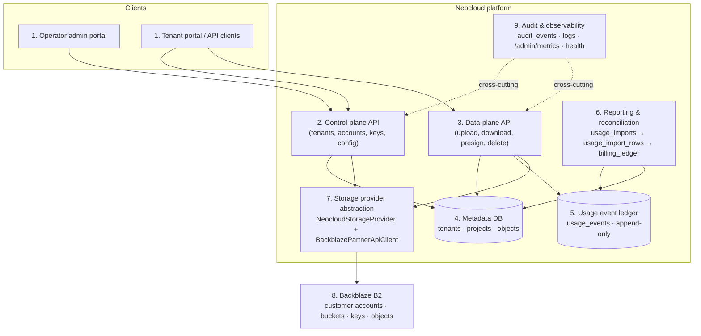

<!-- last_verified: 2026-06-26 -->
# Neocloud Architecture

> For the full set of rendered diagrams (isolation, provisioning, upload, billing,
> data model), see [`docs/architecture-diagrams.md`](architecture-diagrams.md).

## Current starter-kit architecture

The original starter kit is a simple B2-backed file app. It is useful for basic B2 API examples and local developer experience, but it is not enough for neocloud operations. It lacks durable control-plane state, account/sub-account provisioning, tenant isolation, usage/billing, and high-throughput upload workflows.

## Target layers

1. Portal/UI
2. Control-plane API
3. Upload/data-plane API
4. Metadata database
5. Usage event ledger
6. Reporting/reconciliation jobs
7. Storage provider abstraction
8. B2 object storage
9. Audit and observability layer



## Tenant isolation model

Neocloud tenant isolation is account/sub-account-driven. A tenant/customer maps to one or more provisioned B2 customer accounts/sub-accounts, organized through Groups. A Group can hold up to 5,000 accounts. B2 has a default limit of 100 buckets per account, so buckets are child resources used for workload, lifecycle, retention, environment, and policy design.

A customer account lives in a pre-defined region. If a customer needs multiple regions, create multiple B2 customer accounts/sub-accounts for that customer and store the region/account mapping in metadata.

```text
   Operator B2 account
   (holds Partner API access, master key)
            │
            ├──> Group A (one per region / cohort, up to 5,000 accounts)
            │      │
            │      ├──> Customer account (Tenant 1, us-west)
            │      │      ├── Bucket: training-datasets
            │      │      ├── Bucket: training-checkpoints
            │      │      └── Provider keys (scoped to buckets)
            │      │
            │      ├──> Customer account (Tenant 2, us-west)
            │      │      └── Bucket(s) + keys
            │      └──> ... up to 5,000 accounts ...
            │
            └──> Group B (us-east region for DR or other cohort)
                   ├──> Customer account (Tenant 1, us-east)  ← multi-region tenant
                   │      └── Bucket: dr-replica + keys
                   └──> ...

   Isolation boundary = customer account.
   Buckets and keys live inside the customer account.
   Tenants never share a customer account.
```

## B2 file-name model

B2 object keys are B2 file names. Slashes are part of the file name, not real directories. For high-scale generated names, distribute B2 file names across the lexicographical keyspace by making the first file-name component the hash-derived `distribution_id`. The `objects` component in the layout below is not a bucket or directory. Default layout:

```text
{distribution_id}/tenants/{tenant_id}/projects/{project_id}/objects/{object_id}/{safe_filename}
```

`distribution_id` is stable and hash-derived. It is not an authorization mechanism. Object ownership and logical browsing come from metadata.

```text
   Logical view (what tenants see, via metadata DB)
   ─────────────────────────────────────────────
   Tenant: tnt_42
     └─ Project: prj_acme/checkpoints
          └─ Object: model-v3.safetensors  (object_id = obj_7c3a)

   Physical view (what B2 stores)
   ─────────────────────────────────────────────
                  ▼  sha256(tnt_42:prj_acme:obj_7c3a).slice(0,2) = "7f"
   "7f/tenants/tnt_42/projects/prj_acme/objects/obj_7c3a/model-v3.safetensors"
    │   └──────────────── all the rest is content addressing ────────────────┘
    └─ distribution_id (one of 256 leading buckets)

   Why: 256 different distribution_id values for 256 different object IDs
   means writes spread evenly across the lexicographical keyspace. A
   pattern like "uploads/{timestamp}/..." would cluster all writes into
   the same leading range — a hot spot at scale.
```

## Dual API surfaces

Backblaze exposes two HTTP API surfaces against the same data:

- **B2 Native API + Partner API** — purpose-built for B2, plus customer account/Group management. The platform uses this for control plane and platform-mediated data plane.
- **S3-compatible API** — AWS S3 protocol subset, SigV4 auth, exposed at `https://s3.{region}.backblazeb2.com/`. Tenants may use this directly against their customer account using the same B2 application key as the AWS-style credential.

The platform never proxies S3 — tenants who want S3 connect directly to Backblaze. The platform records the per-account S3 endpoint in `storage_accounts.s3_endpoint` so tenants can be told where to point their S3 client.

See `docs/s3-compatible-api.md` for the full S3 surface, and `docs/adr/008-b2-native-vs-s3-compatible.md` for the decision rationale.

## Control plane vs data plane

```text
   ┌──────────────────────────┬──────────────────────────┐
   │      CONTROL PLANE       │       DATA PLANE         │
   │   (infrequent, audited)  │  (high-volume, metered)  │
   ├──────────────────────────┼──────────────────────────┤
   │  tenants                 │  upload sessions         │
   │  storage accounts        │  multipart parts         │
   │  Groups                  │  download URLs           │
   │  projects                │  presigned URLs          │
   │  provider keys           │  object metadata         │
   │  quotas                  │  usage events            │
   │  billing                 │                          │
   │  provisioning            │                          │
   │                          │                          │
   │  ─ admin token required  │  ─ tenant token required │
   │  ─ writes audit_events   │  ─ writes usage_events   │
   │  ─ rate: <100/day        │  ─ rate: any throughput  │
   └──────────────────────────┴──────────────────────────┘
```

Control plane:

- tenants
- storage accounts
- Groups
- projects
- keys
- quotas
- billing
- provisioning

Data plane:

- upload sessions
- multipart parts
- download URLs
- optional range URLs
- object metadata
- usage events

## Upload flow (multipart)

```text
   Client          Platform API           B2 (via provider)
     │                  │                       │
     │  POST .../       │                       │
     │  upload-sessions │                       │
     ├─────────────────▶│                       │
     │                  │  createMultipart...   │
     │                  ├──────────────────────▶│
     │                  │   b2_start_large_file │
     │                  │◀──────────────────────┤
     │                  │  fileId               │
     │   sessionId,     │                       │
     │   partSize, ...  │  (write upload_sessions row)
     │◀─────────────────┤                       │
     │                  │                       │
     │  PUT .../parts/1 │                       │
     ├─────────────────▶│                       │
     │                  │  signUploadPart       │
     │                  ├──────────────────────▶│
     │                  │   b2_get_upload_      │
     │                  │   part_url            │
     │                  │◀──────────────────────┤
     │                  │  (stream part bytes)  │
     │                  ├──────────────────────▶│
     │                  │   b2_upload_part      │
     │                  │◀──────────────────────┤
     │                  │  sha1                 │
     │                  │  (write upload_parts row)
     │   {partNumber:1, │                       │
     │    sha1: "..."}  │                       │
     │◀─────────────────┤                       │
     │   ... parts 2..N concurrently (up to UPLOAD_PART_CONCURRENCY) ...
     │                  │                       │
     │  POST .../       │                       │
     │  complete        │                       │
     ├─────────────────▶│                       │
     │                  │  completeMultipart... │
     │                  ├──────────────────────▶│
     │                  │   b2_finish_large_file│
     │                  │◀──────────────────────┤
     │                  │  (write usage_events, │
     │                  │   audit_events;       │
     │                  │   mark session done)  │
     │   {status:done}  │                       │
     │◀─────────────────┤                       │
```

## High-throughput and small-file strategy

Backblaze B2 should be treated as high-throughput object storage, not high-IOPS tiny-object database storage. Prefer 1 MB+ objects when practical, but do not globally reject smaller objects. When a workload can concatenate, pack, batch, or aggregate small files into larger objects, prefer that pattern. Store manifests or indexes and use range reads to retrieve only the needed logical file or record. This can improve performance and scalability by lowering request rate, reducing per-object overhead, and increasing potential throughput.

## Local development mode

Local development should preserve a fast demo path with a seeded demo tenant, project, user, mock provider, local database, and safe placeholders. Partner API calls must be mockable because Partner API enablement is external to the repo.
